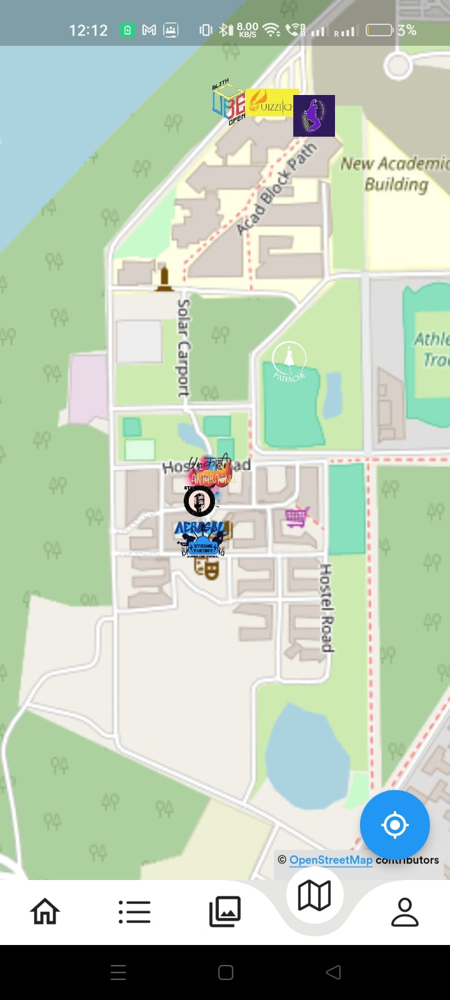

# Blithchron 2023 - IIT Gandhinagar Cultural Fest App

## Introduction
Welcome to the official repository for Blithchron 2023, the annual cultural fest of IIT Gandhinagar. This app serves as a comprehensive guide and interactive platform for one of the most anticipated cultural festivals in the region.

## Features
- **Login Page**: Secure access to personalized experiences.
- **Gallery Page**: Browse through captivating images from past events and current highlights.
- **Sponsors Page**: Acknowledging the sponsors who make the event possible.
- **Campus Navigation**: Detailed campus map to navigate event locations effortlessly.
- **Event Registration**: Easy-to-use interface for event participation.
- **Rulebook**: Access the rules and guidelines for various events.
- **Real-Time Notifications**: Stay updated with the latest happenings during the fest.

## Download
Get the app on the [Google Play Store](https://play.google.com/store/apps/details?id=com.iitgnapp.blithchron).

## Installation
Download the app from the Google Play Store. Ensure your device meets the minimum system requirements.

## Usage
Upon launching the app, users can sign in to access personalized features. Navigate through the app using the intuitive interface to explore different sections like the gallery, event details, campus map, and more.

## Support
For any queries or support, please contact [Support Email].

## Screenshots
<table>
  <tr>
    <td></td>
    <td></td>
    <td></td>
  </tr>
  <tr>
    <td></td>
    <td></td>
    <td></td>
  </tr>
  <tr>
    <td></td>
    <td></td>
  </tr>
</table>
